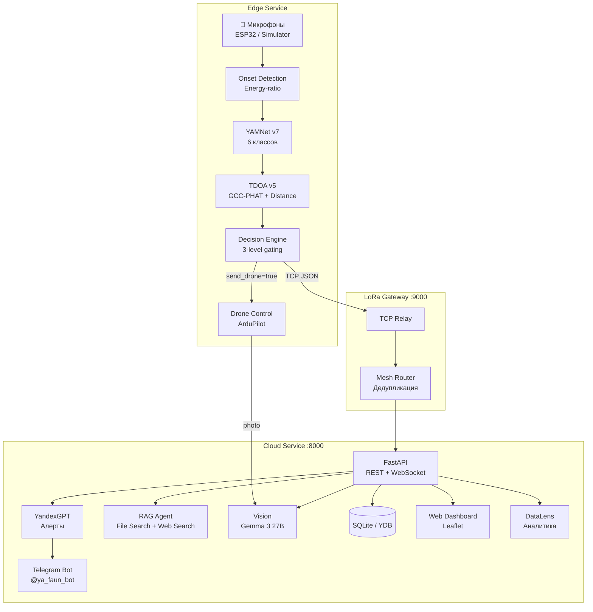
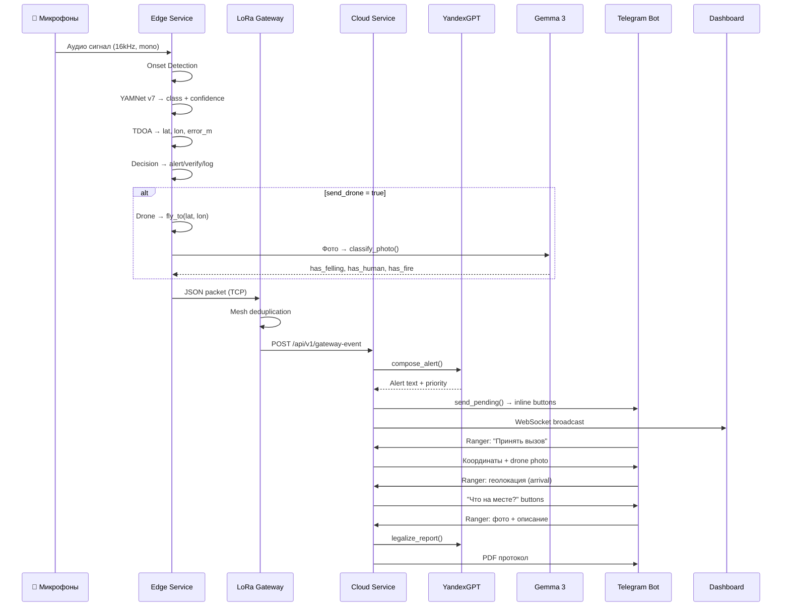
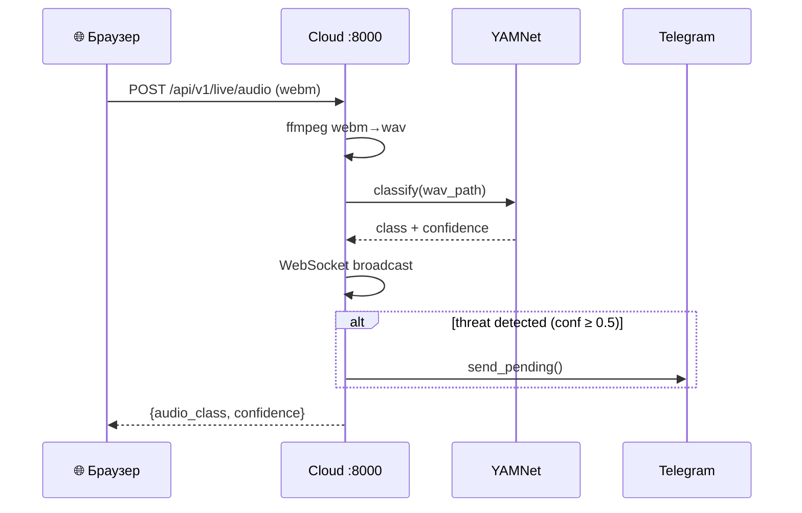

# Архитектура

## Обзор

Faun построен на микросервисной архитектуре из **3 Docker-контейнеров**, взаимодействующих через HTTP/TCP и объединённых общим volume для кэша модели YAMNet.



---

## Сервисы

### Cloud (:8000)

Центральный сервис — FastAPI приложение с Leaflet-дашбордом, Telegram-ботом и всеми AI-интеграциями.

| Модуль | Путь | Назначение |
|--------|------|-----------|
| Interface | `cloud/interface/main.py` | FastAPI endpoints, WebSocket, дашборд |
| Agent | `cloud/agent/` | YandexGPT, RAG, STT, Classification Agent |
| Vision | `cloud/vision/classifier.py` | Gemma 3 27B, yandexgpt-vision-lite |
| Notify | `cloud/notify/` | Telegram-бот, алерты |
| DB | `cloud/db/` | SQLite/YDB, dataclass-ы |
| Analytics | `cloud/analytics/datalens.py` | DataLens endpoints |
| Workflows | `cloud/workflows/` | 12-step pipeline, Yandex Workflows |
| Integrations | `cloud/integrations/fgis_lk.py` | ФГИС ЛК (stub) |

**Lifespan:**

1. Запуск Telegram-бота (polling)
2. Auto-demo (15–25 сек задержка, если не отключён)
3. Seed микрофонов в БД

### Edge

Обрабатывает аудио на «краю» сети: onset detection → classification → triangulation → gating decision.

| Модуль | Путь | Назначение |
|--------|------|-----------|
| Classifier | `edge/audio/classifier.py` | YAMNet v7, 6 классов |
| Onset | `edge/audio/onset.py` | Energy-ratio onset detection |
| TDOA | `edge/tdoa/triangulate.py` | GCC-PHAT триангуляция |
| NDSI | `edge/audio/ndsi.py` | Soundscape index |
| Decider | `edge/decision/decider.py` | Confidence gating |
| Drone | `edge/drone/simulated.py` | Симулированный ArduPilot |

### LoRa Gateway (:9000)

TCP-сервер для приёма JSON-пакетов от edge. Выполняет mesh-дедупликацию, вызывает YandexGPT и Vision, отправляет алерты.

| Модуль | Путь | Назначение |
|--------|------|-----------|
| Relay | `gateway/relay.py` | TCP listener + pipeline |
| Mesh | `gateway/mesh.py` | Mesh routing, дедупликация |

---

## Потоки данных

### Основной pipeline (демо)



### Live pipeline (браузер)



---

## Структура каталогов

```
ya_hve/
├── cloud/
│   ├── agent/
│   │   ├── decision.py           # YandexGPT alert composition
│   │   ├── rag_agent.py          # RAG: File Search + Web Search
│   │   ├── stt.py                # SpeechKit STT
│   │   ├── classification_agent.py # AI verification
│   │   ├── datasphere_client.py  # DataSphere Node
│   │   └── protocol_pdf.py       # PDF generation (fpdf2)
│   ├── analytics/
│   │   ├── datalens.py           # DataLens JSON endpoints
│   │   └── sample_incidents.py   # Seed data for empty DB
│   ├── db/
│   │   ├── incidents.py          # Incident dataclass + state machine
│   │   ├── rangers.py            # Ranger CRUD (SQLite)
│   │   ├── permits.py            # Permit CRUD (SQLite)
│   │   ├── microphones.py        # Microphone network (diamond grid)
│   │   ├── factory.py            # Backend factory (SQLite/YDB)
│   │   ├── ydb_client.py         # YDB driver + DDL
│   │   ├── ydb_incidents.py      # YDB incident repository
│   │   ├── ydb_rangers.py        # YDB ranger repository
│   │   ├── ydb_permits.py        # YDB permit repository
│   │   └── ydb_microphones.py    # YDB microphone repository
│   ├── integrations/
│   │   └── fgis_lk.py            # ФГИС ЛК mock client
│   ├── interface/
│   │   ├── main.py               # FastAPI app (~937 lines)
│   │   └── index.html            # Leaflet dashboard
│   ├── notify/
│   │   ├── bot_handlers.py       # Telegram command/callback handlers
│   │   ├── bot_app.py            # Bot Application setup
│   │   ├── telegram.py           # Alert sending + rate limiting
│   │   └── districts.py          # District definitions
│   ├── vision/
│   │   └── classifier.py         # Gemma 3 → yandexgpt-vision → stub
│   └── workflows/
│       ├── pipeline.py           # 12-step pipeline definition
│       └── yandex_workflows.py   # Yandex Workflows API
├── edge/
│   ├── audio/
│   │   ├── classifier.py         # YAMNet v7 + head model
│   │   ├── onset.py              # Energy-ratio onset detector
│   │   └── ndsi.py               # NDSI soundscape index
│   ├── tdoa/
│   │   ├── triangulate.py        # TDOA + distance fusion
│   │   └── distance.py           # Energy-based distance estimation
│   ├── decision/
│   │   └── decider.py            # 3-level confidence gating
│   └── drone/
│       └── simulated.py          # ArduPilot simulator
├── gateway/
│   ├── relay.py                  # LoRa TCP relay
│   └── mesh.py                   # Mesh routing + deduplication
├── simulator/
│   ├── audio/mic_stream.py       # Audio stream simulator
│   ├── drone/drone_stream.py     # Drone flight simulator
│   └── lora/socket_relay.py      # LoRa relay simulator
├── devices/                      # ESP32 firmware
├── tests/                        # 12 test files + conftest.py
├── docs/
│   ├── legal/                    # 9 normative documents
│   └── notebooks/                # 3 Jupyter notebooks
└── demo/                         # Demo audio files
```
