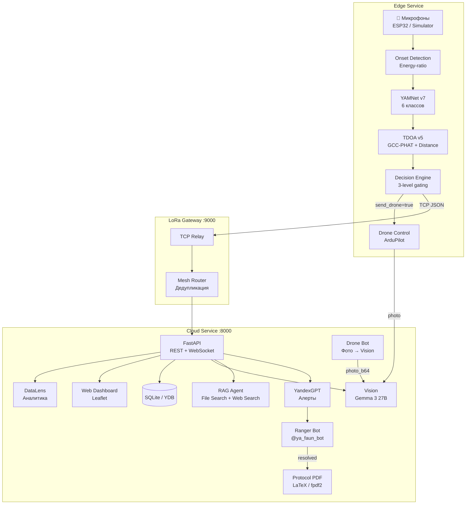
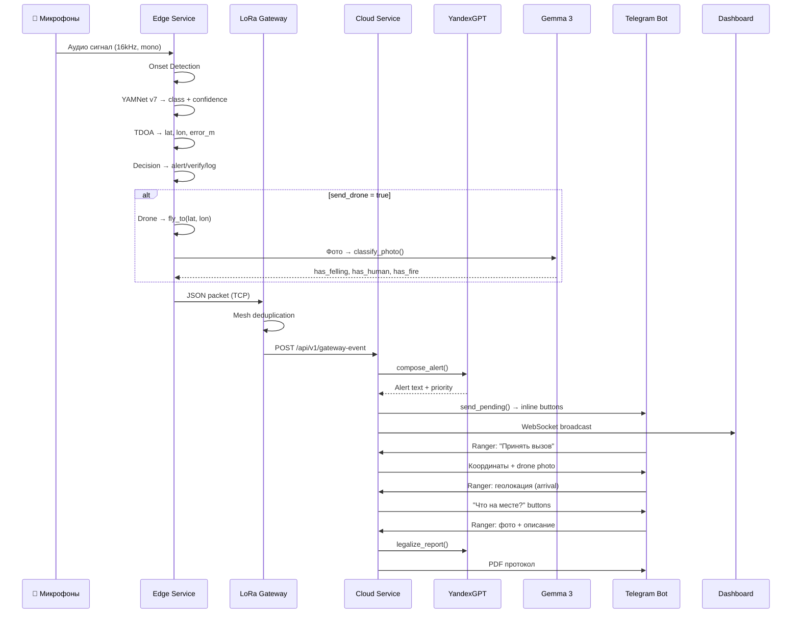
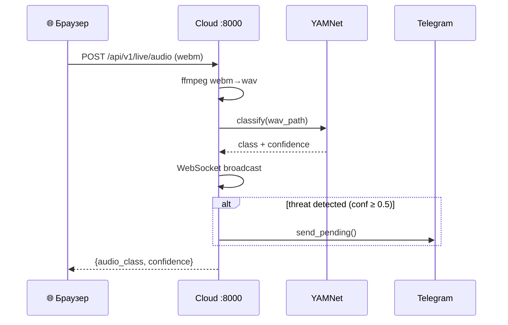

# Архитектура

## Обзор

Faun построен на микросервисной архитектуре из **3 Docker-контейнеров**, взаимодействующих через HTTP/TCP и объединённых общим volume для кэша модели YAMNet.



---

## Сервисы

### Cloud (:8000)

Центральный сервис — FastAPI приложение с Leaflet-дашбордом, Telegram-ботом и всеми AI-интеграциями.

| Модуль | Путь | Назначение |
|--------|------|-----------|
| Interface | `cloud/interface/main.py` | FastAPI endpoints, WebSocket, дашборд (~1300 строк) |
| Agent | `cloud/agent/` | YandexGPT, RAG, STT, Classification Agent, Protocol PDF |
| Vision | `cloud/vision/classifier.py` | Gemma 3 27B → yandexgpt-vision-lite → stub (3-level fallback) |
| Notify | `cloud/notify/` | Ranger Bot + Drone Bot, зональные алерты |
| DB | `cloud/db/` | SQLite/YDB dual-backend, factory pattern |
| Analytics | `cloud/analytics/datalens.py` | DataLens JSON endpoints + sample data |
| Workflows | `cloud/workflows/` | 12-step pipeline, Yandex Workflows API (stub) |
| Integrations | `cloud/integrations/fgis_lk.py` | ФГИС ЛК (stub) |

**Lifespan:**

1. Запуск Ranger Bot (polling) — `@ya_faun_bot`
2. Запуск Drone Bot (polling) — принимает фото для Vision-анализа
3. Seed микрофонов в БД (diamond grid)
4. Auto-demo (45–60 сек задержка, рандомный сценарий — если не задан `DISABLE_AUTO_DEMO`)

### Edge (:8001)

Обрабатывает аудио на «краю» сети: onset detection → classification → triangulation → gating decision. Предоставляет HTTP API для классификации на порту 8001.

| Модуль | Путь | Назначение |
|--------|------|-----------|
| Classifier | `edge/audio/classifier.py` | YAMNet v7/v8, 6 классов, 2048-dim features |
| Classify API | `edge/classify_api.py` | FastAPI HTTP wrapper (`:8001/api/v1/classify`) |
| Onset | `edge/audio/onset.py` | Energy-ratio onset detection |
| NDSI | `edge/audio/ndsi.py` | Normalized Difference Soundscape Index |
| TDOA | `edge/tdoa/triangulate.py` | GCC-PHAT + energy-based distance fusion |
| Distance | `edge/tdoa/distance.py` | Energy-based distance estimation (inverse-square law) |
| Decider | `edge/decision/decider.py` | Confidence gating (3 уровня) |
| Drone Base | `edge/drone/base.py` | Абстрактный DroneInterface |
| Drone ArduPilot | `edge/drone/ardupilot.py` | Реальный MAVLink drone (UDP) |
| Drone Simulated | `edge/drone/simulated.py` | Симулированный drone для демо |
| Server | `edge/server.py` | Event-driven pipeline (main loop) |

Cloud-сервис вызывает edge через HTTP (`POST /api/v1/classify`) вместо прямого импорта TensorFlow, что изолирует тяжёлую ML-зависимость.

### LoRa Gateway (:9000)

TCP-сервер для приёма JSON-пакетов от edge. Выполняет mesh-дедупликацию, вызывает YandexGPT и Vision, отправляет алерты.

| Модуль | Путь | Назначение |
|--------|------|-----------|
| Relay | `gateway/relay.py` | TCP listener + pipeline |
| Mesh | `gateway/mesh.py` | Mesh routing, дедупликация |

---

## Потоки данных

### Основной pipeline (демо)



### Live pipeline (браузер)



---

## Структура каталогов

```
faun/
├── cloud/
│   ├── agent/
│   │   ├── decision.py           # YandexGPT alert composition
│   │   ├── rag_agent.py          # RAG: File Search + Web Search
│   │   ├── stt.py                # SpeechKit STT
│   │   ├── classification_agent.py # AI verification
│   │   ├── datasphere_client.py  # DataSphere Node
│   │   ├── protocol_pdf.py       # PDF generation (LaTeX/Jinja2 + fpdf2 fallback)
│   │   └── templates/            # Jinja2 LaTeX шаблоны
│   ├── analytics/
│   │   ├── datalens.py           # DataLens JSON endpoints
│   │   └── sample_incidents.py   # Seed data for empty DB
│   ├── db/
│   │   ├── base.py               # Abstract repository interfaces
│   │   ├── factory.py            # Backend factory (SQLite/YDB auto-detect)
│   │   ├── incidents.py          # Incident dataclass + state machine
│   │   ├── rangers.py            # Ranger CRUD (SQLite)
│   │   ├── permits.py            # Permit CRUD (SQLite)
│   │   ├── microphones.py        # Microphone network (diamond grid)
│   │   ├── ydb_client.py         # YDB driver + DDL
│   │   ├── ydb_incidents.py      # YDB incident repository
│   │   ├── ydb_rangers.py        # YDB ranger repository
│   │   ├── ydb_permits.py        # YDB permit repository
│   │   └── ydb_microphones.py    # YDB microphone repository
│   ├── integrations/
│   │   └── fgis_lk.py            # ФГИС ЛК mock client
│   ├── interface/
│   │   ├── main.py               # FastAPI app (~1300 lines)
│   │   ├── index.html            # Leaflet dashboard
│   │   └── analytics.html        # DataLens analytics page
│   ├── notify/
│   │   ├── bot_app.py            # Ranger Bot Application setup
│   │   ├── bot_handlers.py       # Ranger Bot command/callback handlers
│   │   ├── drone_bot_app.py      # Drone Bot Application setup
│   │   ├── drone_bot_handlers.py # Drone Bot photo → Vision → alert pipeline
│   │   ├── telegram.py           # Alert sending + zone routing + rate limiting
│   │   └── districts.py          # District definitions (8 участковых лесничеств)
│   ├── vision/
│   │   └── classifier.py         # Gemma 3 → yandexgpt-vision → stub
│   └── workflows/
│       ├── pipeline.py           # 12-step pipeline definition
│       └── yandex_workflows.py   # Yandex Workflows API (stub)
├── edge/
│   ├── audio/
│   │   ├── classifier.py         # YAMNet v7/v8 + fine-tuned head
│   │   ├── onset.py              # Energy-ratio onset detector
│   │   └── ndsi.py               # NDSI soundscape index
│   ├── tdoa/
│   │   ├── triangulate.py        # GCC-PHAT TDOA + energy fusion
│   │   └── distance.py           # Energy-based distance estimation
│   ├── decision/
│   │   └── decider.py            # 3-level confidence gating
│   ├── drone/
│   │   ├── base.py               # Abstract DroneInterface
│   │   ├── ardupilot.py          # Real ArduPilot/MAVLink drone
│   │   └── simulated.py          # Simulated drone for demo
│   ├── classify_api.py           # FastAPI HTTP classify (:8001)
│   └── server.py                 # Main event-driven pipeline
├── gateway/
│   ├── relay.py                  # LoRa TCP relay + full alert pipeline
│   └── mesh.py                   # Mesh routing + deduplication
├── simulator/
│   ├── audio/
│   │   ├── mic_stream.py         # Audio stream simulator (TDOA delays)
│   │   └── real_mic.py           # Real microphone capture (sounddevice)
│   ├── drone/drone_stream.py     # Drone flight simulator
│   └── lora/socket_relay.py      # LoRa TCP relay simulator
├── devices/
│   ├── mic_node/main.c           # ESP32 firmware (I2S + LoRa + deep sleep)
│   └── drone_node/firmware.py    # Drone companion computer (MAVLink)
├── demo/
│   ├── audio/                    # WAV files (ESC-50 / UrbanSound8K)
│   ├── photos/                   # Aerial JPEG (by scenario)
│   ├── scenarios/                # Quick demo triggers
│   ├── generate_audio.py         # Download real samples / synthesize fallback
│   ├── download_photos.py        # Download aerial photos from Pexels
│   ├── presentation_script.py    # 5-step demo flow for jury
│   └── run_demo.py               # Full demo launcher
├── data/
│   └── varnavino_boundary.geojson # GeoJSON polygon Варнавинского лесничества
├── tests/                        # 30+ test files + conftest.py
├── docs/                         # MkDocs documentation
│   ├── legal/                    # 9 normative documents for RAG
│   ├── notebooks/                # 3 Jupyter notebooks (data, yamnet, distance)
│   ├── results/                  # CSV с метриками
│   └── graphs/                   # PNG графики из PoC
├── graphs/                       # Presentation graphs
├── workflows/                    # GitHub Actions CI/CD
├── docker-compose.yml            # 3 services: cloud, edge, lora_gateway
├── Dockerfile                    # Python 3.11-slim + texlive + ffmpeg
├── requirements.txt              # Python dependencies
├── demo.sh                       # Demo launch script
├── cleanup.sh                    # Cleanup script
└── generate_presentation_graphs.py # Presentation graph generator
```
