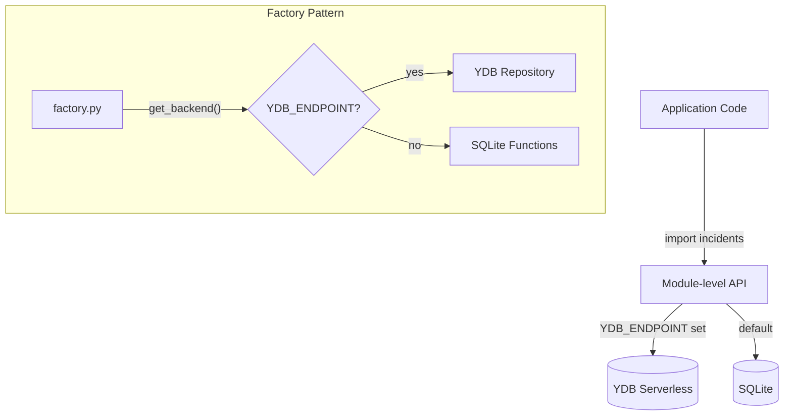
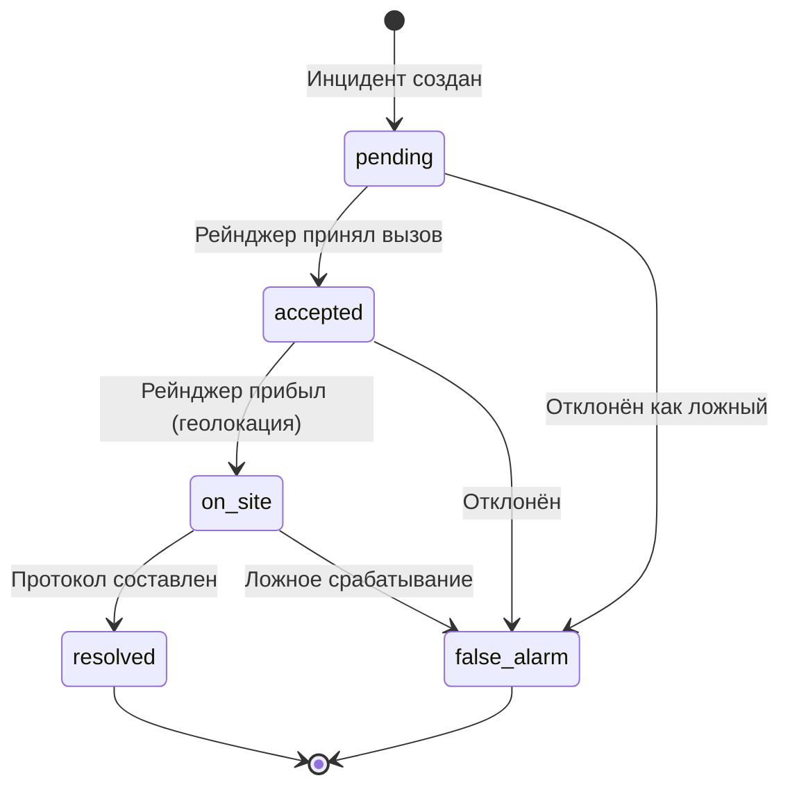

# База данных

## Dual-Backend архитектура

Faun поддерживает два backend-а для хранения данных:

- **SQLite** — локальный, по умолчанию (разработка, тесты)
- **YDB Serverless** — облачный (продакшн, Yandex Cloud)

Переключение автоматическое: если установлена переменная `YDB_ENDPOINT`, используется YDB. Иначе — SQLite.



### Factory Pattern (`cloud/db/factory.py`)

```python
def get_backend() -> str:
    """Return 'ydb' or 'sqlite' based on environment."""

def get_ranger_repository() -> RangerRepository | None
def get_permit_repository() -> PermitRepository | None
def get_incident_repository() -> IncidentRepository | None
def get_microphone_repository() -> MicrophoneRepository | None
```

Для SQLite возвращает `None` — вызывающий код использует модульные функции напрямую (обратная совместимость).

---

## Dataclass-ы

### Incident

Инцидент — центральная сущность системы. Хранит весь lifecycle от обнаружения до разрешения.

```python
@dataclass
class Incident:
    id: str                              # UUID
    audio_class: str                     # chainsaw, gunshot, engine, axe, fire
    lat: float                           # Координата N
    lon: float                           # Координата E
    confidence: float                    # Уверенность классификатора (0.0–1.0)
    gating_level: str                    # alert / verify / log
    status: str = "pending"              # State machine (см. ниже)
    created_at: float                    # Unix timestamp
    district: str = ""                   # Лесничество (auto)
    drone_photo_b64: str | None          # Фото с дрона (base64)
    drone_comment: str | None            # Комментарий AI к фото
    accepted_by_chat_id: int | None      # Telegram chat_id рейнджера
    accepted_by_name: str | None         # ФИО рейнджера
    accepted_at: float | None            # Когда принят
    arrived_at: float | None             # Когда прибыл на место
    response_time_min: float | None      # Время реагирования (мин)
    alert_message_ids: dict[int, int]    # chat_id → message_id
    ranger_photo_b64: str | None         # Фото от рейнджера
    ranger_report_raw: str | None        # Описание (текст/STT)
    ranger_report_legal: str | None      # Юридизация через YandexGPT
    protocol_pdf: bytes | None           # PDF протокола
    resolution_details: str = ""         # Детали закрытия
    is_demo: bool = False                # Демо-инцидент
```

### Ranger

```python
@dataclass
class Ranger:
    id: int
    name: str                  # ФИО
    badge_number: str          # Табельный номер
    chat_id: int               # Telegram chat_id
    zone_lat_min: float        # Зона: bounding box
    zone_lat_max: float
    zone_lon_min: float
    zone_lon_max: float
    active: bool               # Получает ли алерты
    current_lat: float | None  # Текущая позиция
    current_lon: float | None
```

### Permit

```python
@dataclass
class Permit:
    id: int
    description: str           # Описание (вид рубки)
    zone_lat_min: float        # Зона действия (bounding box)
    zone_lat_max: float
    zone_lon_min: float
    zone_lon_max: float
    valid_from: date           # Начало действия
    valid_until: date          # Окончание действия
```

### Microphone

```python
@dataclass
class Microphone:
    id: int
    mic_uid: str               # "MIC-0001"
    lat: float
    lon: float
    zone_type: str             # exploitation, oopt, water_protection, ...
    sub_district: str          # Участковое лесничество
    status: str                # online / offline / broken
    battery_pct: float         # Заряд батареи (0–100)
    district_slug: str         # "varnavino"
    installed_at: str          # Дата установки
```

---

## Incident State Machine



### Допустимые переходы

| Текущий статус | Допустимые переходы |
|----------------|-------------------|
| `pending` | `accepted`, `false_alarm` |
| `accepted` | `on_site`, `false_alarm` |
| `on_site` | `resolved`, `false_alarm` |
| `resolved` | — (терминальный) |
| `false_alarm` | — (терминальный) |

### Защита от concurrent accept

Если `new_status == incident.status` — операция игнорируется (no-op). Это предотвращает гонку, когда два рейнджера одновременно нажимают "Принять вызов".

### Обновляемые поля

Только поля из `_UPDATABLE_FIELDS` могут быть изменены через `update_incident()`:

```text
status, accepted_by_chat_id, accepted_by_name, accepted_at,
arrived_at, response_time_min, drone_photo_b64, drone_comment,
ranger_photo_b64, ranger_report_raw, ranger_report_legal,
protocol_pdf, resolution_details, district, is_demo
```

---

## YDB DDL

### Rangers

```sql
CREATE TABLE rangers (
    id Uint64,
    name Utf8,
    badge_number Utf8,
    chat_id Int64,
    zone_lat_min Double,
    zone_lat_max Double,
    zone_lon_min Double,
    zone_lon_max Double,
    active Bool,
    PRIMARY KEY (id)
)
```

### Permits

```sql
CREATE TABLE permits (
    id Uint64,
    description Utf8,
    zone_lat_min Double,
    zone_lat_max Double,
    zone_lon_min Double,
    zone_lon_max Double,
    valid_from Utf8,
    valid_until Utf8,
    PRIMARY KEY (id)
)
```

### Incidents

```sql
CREATE TABLE incidents (
    id Utf8,
    audio_class Utf8,
    lat Double,
    lon Double,
    confidence Double,
    gating_level Utf8,
    status Utf8,
    accepted_by_chat_id Int64,
    accepted_by_name Utf8,
    accepted_at Double,
    created_at Double,
    arrived_at Double,
    response_time_min Double,
    district Utf8,
    ranger_report_raw Utf8,
    ranger_report_legal Utf8,
    resolution_details Utf8,
    is_demo Bool,
    PRIMARY KEY (id)
)
```

### Microphones

```sql
CREATE TABLE microphones (
    id Uint64,
    mic_uid Utf8,
    lat Double,
    lon Double,
    zone_type Utf8,
    sub_district Utf8,
    status Utf8,
    battery_pct Double,
    district_slug Utf8,
    installed_at Utf8,
    PRIMARY KEY (id)
)
```

---

## Сеть микрофонов

### Diamond Grid

Микрофоны размещаются на ромбовидной (diamond) сетке с шагом `MIC_GRID_SPACING_M` (по умолчанию 1000 м). Нечётные ряды смещены на пол-шага, вертикальный шаг = `spacing × √3/2`. Это обеспечивает максимально плотное покрытие для круговых зон детекции.

### Зоны

| Тип зоны | Вес (%) | Описание |
|----------|---------|----------|
| `exploitation` | 80% | Эксплуатационные леса |
| `oopt` | 5% | ООПТ |
| `water_protection` | 4% | Водоохранные зоны |
| `protective_strip` | 3% | Защитные полосы |
| `green_zone` | 2% | Зелёные зоны |
| `water_restricted` | 2% | Запретные полосы |
| `spawning_protection` | 2% | Нерестоохранные |
| `anti_erosion` | 2% | Противоэрозионные |

### Участковые лесничества (Варнавино)

| Slug | Название | Координаты |
|------|---------|------------|
| `mdalskoe` | Мдальское | 57.40–57.55°N, 44.60–44.80°E |
| `semyonborskoe` | Семёнборское | 57.35–57.50°N, 44.80–45.00°E |
| `poplyvinskoye` | Поплывинское | 57.30–57.45°N, 45.00–45.20°E |
| `kamennikoskoye` | Каменниковское | 57.20–57.35°N, 44.60–44.80°E |
| `varnavinskoye` | Варнавинское | 57.15–57.30°N, 44.80–45.00°E |
| `kolesnikovskoye` | Колесниковское | 57.10–57.25°N, 45.00–45.20°E |
| `kameshnoye` | Камешное | 57.05–57.20°N, 45.10–45.30°E |
| `kayskoye` | Кайское | 57.05–57.20°N, 45.20–45.40°E |

Bounding box всего района: **57.05–57.55°N, 44.60–45.40°E**.

---

## API для работы с данными

Все CRUD-операции доступны через модульные функции:

```python
# Incidents
create_incident(audio_class, lat, lon, confidence, gating_level) -> Incident
get_incident(incident_id) -> Incident | None
update_incident(incident_id, **fields) -> None
get_all_incidents() -> list[Incident]

# Rangers
add_ranger(name, chat_id, zone_lat_min, ...) -> Ranger
get_rangers_for_location(lat, lon) -> list[Ranger]
get_nearest_rangers(lat, lon, limit=3) -> list[Ranger]

# Permits
add_permit(zone_lat_min, ..., valid_from, valid_until) -> Permit
has_valid_permit(lat, lon, on_date=None) -> bool

# Microphones
seed_microphones(spacing_m=1000) -> list[Microphone]
get_all() -> list[Microphone]
get_online() -> list[Microphone]
```
