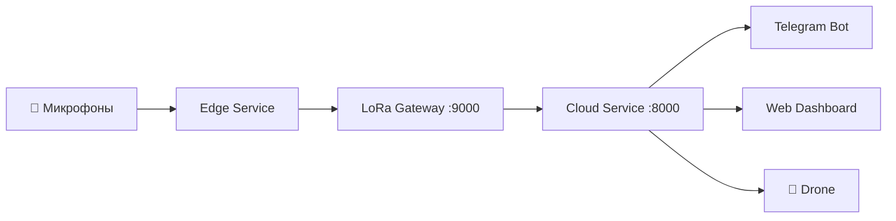

# Faun — AI-система акустического мониторинга леса

**Faun** — система реального времени для обнаружения и локализации нарушений в лесных массивах (незаконная рубка, браконьерство, техника) с помощью сети микрофонов и AI.

Проект разработан для кейс-чемпионата **Яндекс Social Tech Lab** (НИУ ВШЭ), технический трек — экология.

---

## Возможности

- **Акустическая классификация** — YAMNet v7 распознаёт 6 типов звуков: бензопила, выстрел, двигатель, топор, огонь, фон
- **Триангуляция** — TDOA v5 определяет координаты источника по массиву из 3 микрофонов
- **Confidence Gating** — 3 уровня реагирования: alert / verify / log
- **Telegram-бот** — зональные уведомления рейнджерам с inline-действиями
- **YandexGPT** — AI-генерация алертов с юридическим контекстом
- **RAG-агент** — поиск по 9 нормативным документам (File Search + Web Search)
- **Дрон** — автоматический вылет для фото-верификации (ArduPilot)
- **Дашборд** — веб-интерфейс на Leaflet с real-time картой инцидентов

---

## Архитектура

Система состоит из **3 Docker-сервисов**:

| Сервис | Порт | Назначение |
|--------|------|------------|
| **cloud** | `:8000` | FastAPI дашборд, Telegram-бот, YandexGPT, RAG-агент |
| **edge** | — | YAMNet classifier, TDOA триангуляция, decision engine |
| **lora_gateway** | `:9000` | LoRa mesh relay для связи edge ↔ cloud |



---

## 10 сервисов Yandex Cloud AI Studio

| # | Сервис | Применение |
|---|--------|-----------|
| 1 | YandexGPT | Генерация алертов, юридический анализ |
| 2 | AI Studio Assistants API | RAG-агент для правовых консультаций |
| 3 | File Search | Поиск по 9 нормативным документам |
| 4 | Web Search | Актуальные правовые нормы |
| 5 | SpeechKit STT | Распознавание голосовых сообщений |
| 6 | Gemma 3 27B | Анализ фото с дрона |
| 7 | Yandex Workflows | 12-шаговый pipeline обработки инцидентов |
| 8 | Classification Agent | AI-верификация классификации |
| 9 | DataSphere | Обучение YAMNet v7 |
| 10 | DataLens | Аналитический дашборд |

---

## Быстрый старт

```bash
# Клонировать репозиторий
git clone https://github.com/glebsem2005/ya_hve.git
cd ya_hve

# Настроить переменные окружения
cp .env.example .env
# Заполнить TELEGRAM_BOT_TOKEN, YANDEX_API_KEY, YANDEX_FOLDER_ID

# Запустить
docker compose up -d
```

Дашборд доступен на [http://localhost:8000](http://localhost:8000), Telegram-бот: [@ya_faun_bot](https://t.me/ya_faun_bot).

---

## Разделы документации

- [Архитектура](architecture.md) — сервисы, взаимодействие, диаграммы
- [ML Pipeline](ml-pipeline.md) — YAMNet v7, TDOA v5, onset detection, gating
- [API Reference](api.md) — все эндпоинты с описанием
- [База данных](database.md) — SQLite/YDB dual-backend, state machine
- [Telegram-бот](telegram-bot.md) — регистрация, зоны, алерты
- [Yandex Cloud](yandex-cloud.md) — 10 сервисов AI Studio
- [Деплой](deployment.md) — Docker, VPS, конфигурация
- [Тестирование](testing.md) — тесты, покрытие, CI/CD
- [Правовая база](legal/README.md) — 9 нормативных документов
