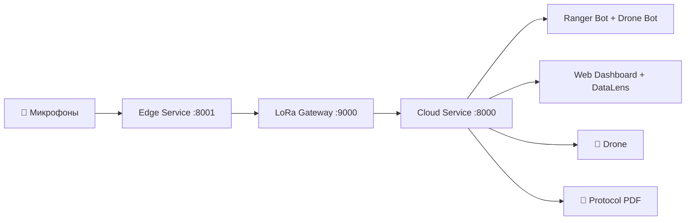

# Faun — AI-система акустического мониторинга леса

**Faun** — система реального времени для обнаружения и локализации нарушений в лесных массивах (незаконная рубка, браконьерство, техника) с помощью сети микрофонов и AI.

Проект разработан для кейс-чемпионата **Яндекс Social Tech Lab** (НИУ ВШЭ), технический трек — экология.

---

## Возможности

- **Акустическая классификация** — YAMNet v7/v8 распознаёт 6 типов звуков: бензопила, выстрел, двигатель, топор, огонь, фон
- **Триангуляция** — TDOA v5 определяет координаты источника по массиву из 3 микрофонов
- **Confidence Gating** — 3 уровня реагирования (alert / verify / log) с дифференцированными порогами по классам
- **Два Telegram-бота** — Ranger Bot (зональные алерты, регистрация, workflow) + Drone Bot (фото → Vision)
- **YandexGPT** — AI-генерация контекстных алертов с визуальными деталями
- **RAG-агент** — поиск по 9 нормативным документам (File Search + Web Search + enriched context)
- **Vision (Gemma 3 27B)** — расширенный анализ фото: техника, повреждения, оценка площади ущерба
- **Дрон** — автоматический вылет для фото-верификации (ArduPilot / симулятор)
- **Protocol PDF** — автоматическая генерация Акта патрулирования (LaTeX + RAG)
- **Edge HTTP API** — изолированная классификация на порту 8001 (TF в отдельном контейнере)
- **Дашборд** — веб-интерфейс на Leaflet с real-time картой + DataLens аналитика

---

## Архитектура

Система состоит из **3 Docker-сервисов**:

| Сервис | Порт | Назначение |
|--------|------|------------|
| **cloud** | `:8000` | FastAPI дашборд, 2 Telegram-бота, YandexGPT, RAG-агент, Protocol PDF |
| **edge** | `:8001` | YAMNet v7/v8 classifier, TDOA триангуляция, decision engine, HTTP classify API |
| **lora_gateway** | `:9000` | LoRa mesh relay для связи edge ↔ cloud |



---

## 10 сервисов Yandex Cloud AI Studio

| # | Сервис | Применение |
|---|--------|-----------|
| 1 | YandexGPT | Генерация алертов, юридический анализ |
| 2 | AI Studio Assistants API | RAG-агент для правовых консультаций |
| 3 | File Search | Поиск по 9 нормативным документам |
| 4 | Web Search | Актуальные правовые нормы |
| 5 | SpeechKit STT | Распознавание голосовых сообщений |
| 6 | Gemma 3 27B | Анализ фото с дрона |
| 7 | Yandex Workflows | 12-шаговый pipeline обработки инцидентов |
| 8 | Classification Agent | AI-верификация классификации |
| 9 | DataSphere | Обучение YAMNet v7 |
| 10 | DataLens | Аналитический дашборд |

---

## Production-ссылки

| Ресурс | URL |
|--------|-----|
| Дашборд | [https://faun-forrest.duckdns.org/](https://faun-forrest.duckdns.org/) |
| Документация | [https://faun-forrest.duckdns.org:8080/](https://faun-forrest.duckdns.org:8080/) |
| Ranger Bot | [@ya_faun_bot](https://t.me/ya_faun_bot) |
| Drone Bot | Токен в `.env` (`TELEGRAM_DRONE_BOT_TOKEN`) |

---

## Быстрый старт

```bash
# Клонировать репозиторий
git clone https://github.com/gianhu403-hash/faun.git
cd faun

# Настроить переменные окружения
cp .env.example .env
# Заполнить: TELEGRAM_BOT_TOKEN, TELEGRAM_DRONE_BOT_TOKEN,
#            YANDEX_API_KEY, YANDEX_FOLDER_ID, SEARCH_INDEX_ID

# Запустить
docker compose up -d
```

Дашборд: [http://localhost:8000](http://localhost:8000) (dev) / [https://faun-forrest.duckdns.org/](https://faun-forrest.duckdns.org/) (prod).
Telegram-бот: [@ya_faun_bot](https://t.me/ya_faun_bot).

---

## Разделы документации

- [Архитектура](architecture.md) — сервисы, взаимодействие, диаграммы
- [ML Pipeline](ml-pipeline.md) — YAMNet v7, TDOA v5, onset detection, gating
- [API Reference](api.md) — все эндпоинты с описанием
- [База данных](database.md) — SQLite/YDB dual-backend, state machine
- [Telegram-бот](telegram-bot.md) — регистрация, зоны, алерты
- [Yandex Cloud](yandex-cloud.md) — 10 сервисов AI Studio
- [Деплой](deployment.md) — Docker, VPS, конфигурация
- [Тестирование](testing.md) — тесты, покрытие, CI/CD
- [Правовая база](legal/README.md) — 9 нормативных документов
