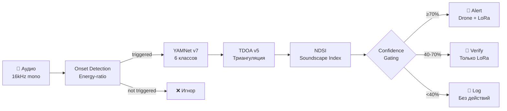

# ML Pipeline

## Обзор

Pipeline обработки аудио: onset detection → YAMNet v7 classification → TDOA v5 triangulation → confidence gating → action.



---

## YAMNet v7 / v8

### Архитектура

**Base model:** [Google YAMNet](https://tfhub.dev/google/yamnet/1) — MobileNet v1 backbone, обученный на AudioSet (521 класс).

**Fine-tuned head:** Keras Dense, обученный на 6 целевых классах:

| Индекс | Класс | Описание |
|--------|-------|----------|
| 0 | `chainsaw` | Бензопила |
| 1 | `gunshot` | Выстрел |
| 2 | `engine` | Двигатель техники |
| 3 | `axe` | Топор |
| 4 | `fire` | Огонь / треск |
| 5 | `background` | Фоновые звуки леса |

### Feature Extraction

```text
Computed features = mean(embeddings)[1024] + max(embeddings)[1024] = 2048 dim
Head model input  = 2048 + zero-padding → expected_dim (2181 for v7)
```

YAMNet генерирует embeddings размерности 1024 для каждого 0.96-секундного фрейма. Для классификации используется конкатенация mean и max pooling по всем фреймам (2048 dims), которая дополняется нулями до `expected_dim` модели-головы.

### Two-tier Classification

1. **Head model** (fine-tuned) — если confidence ≥ 0.50 для не-background класса
2. **Base YAMNet fallback** — суммарная агрегация из 521 → 6 классов через `YAMNET_CLASS_MAP`

### YAMNET_CLASS_MAP

Маппинг из 521 классов AudioSet в 6 целевых:

| AudioSet класс | Целевой класс |
|----------------|--------------|
| Chainsaw, Power tool | `chainsaw` |
| Gunshot, Gunfire, Firearms, Machine gun, Cap gun | `gunshot` |
| Engine, Vehicle, Motorcycle, Truck, Bus, ... | `engine` |
| Chop, Wood | `axe` |
| Fire, Crackle, Fire alarm | `fire` |

**Порог:** `YAMNET_THRESHOLD = 0.15` — минимальный суммарный score для не-background класса.

### Вход/выход

```python
def classify(audio_path: str) -> AudioResult:
    """
    Input:  WAV file (16kHz mono, float32)
    Output: AudioResult(label, confidence, raw_scores)
    """
```

- Минимальная длина: 15600 сэмплов (~0.975 сек). Более короткие сигналы дополняются нулями
- Mono: многоканальные сигналы усредняются

### Edge Classify HTTP API

Cloud-сервис вызывает edge через HTTP API вместо прямого импорта TensorFlow:

```
POST http://edge:8001/api/v1/classify
Content-Type: multipart/form-data
Body: file=audio.wav
```

Это изолирует тяжёлую ML-зависимость (TensorFlow) в отдельном контейнере. При ошибке cloud выполняет retry (2 попытки с 2-секундной паузой) и возвращает `AudioResult(label="unknown", confidence=0.0)`.

### YAMNet v8 (PCEN + Temporal)

v8 расширяет feature extraction:

```text
v7: mean(emb)[1024] + max(emb)[1024] = 2048 dim
v8: mean(emb)[1024] + max(emb)[1024] + PCEN[128] + temporal_var[5] = 2205 dim
```

- **PCEN** — Per-Channel Energy Normalization спектрограмма (128-dim)
- **Temporal variance** — дисперсия по 5 временным окнам (5-dim)
- Модель: `yamnet_forest_classifier_v8.keras`

---

## Onset Detection

Энергетический детектор резких звуков (бензопила, выстрел, удар топора). Срабатывает только при внезапном скачке энергии сигнала.

### Алгоритм

1. Вычисление RMS-энергии в скользящих окнах
2. Сравнение с адаптивным порогом (медиана истории — устойчива к выбросам)
3. Срабатывание при превышении порога
4. Cooldown для предотвращения дублирования

### Параметры

| Параметр | Значение | Описание |
|----------|---------|----------|
| `FRAME_SIZE` | 512 | ~32 мс при 16kHz |
| `HOP_SIZE` | 256 | ~16 мс между фреймами |
| `ENERGY_RATIO_THRESHOLD` | 8.0 | Порог short/long-term ratio |
| `LONG_TERM_FRAMES` | 30 | ~480 мс истории для baseline |
| `MIN_ABSOLUTE_ENERGY` | 1e-4 | Порог тишины |
| `COOLDOWN_FRAMES` | 60 | ~960 мс cooldown |

### Использование

```python
# Stateless (одноразовый анализ)
event = detect_onset(waveform, sample_rate=16000)

# Stateful (потоковый мониторинг)
detector = OnsetDetector()
event = detector.detect(chunk)  # сохраняет baseline между вызовами
```

### OnsetEvent

```python
@dataclass
class OnsetEvent:
    triggered: bool      # Обнаружен ли резкий звук
    frame_index: int     # Какой фрейм сработал
    energy_ratio: float  # Пиковое отношение энергий
    peak_energy: float   # Абсолютная энергия
```

---

## TDOA v5

Time Difference of Arrival — определение координат источника звука по массиву из 3 микрофонов.

### Алгоритм

Комбинация двух подходов:

1. **TDOA (GCC-PHAT)** — разность расстояний между парами микрофонов
2. **Energy-based ranging** — абсолютная дистанция до каждого микрофона (закон обратных квадратов)

### 10 улучшений (v5)

| # | Улучшение | Описание |
|---|-----------|----------|
| 1 | Subpixel interpolation | Квадратичная параболическая интерполяция пика GCC |
| 2 | PHAT-beta (0.75) | Мягкое whitening вместо строгого PHAT |
| 3 | Median GCC | Медиана для baseline (устойчивость к выбросам) |
| 4 | MAD outlier | Median Absolute Deviation для фильтрации |
| 5 | DEMON | Demodulation of Envelope for Modulated signals |
| 6 | SNR-weighting | Вес пар пропорционален SNR микрофонов |
| 7 | Multi-start | 5 начальных точек для Nelder-Mead |
| 8 | Bandpass filter | Butterworth 200–6000 Hz |
| 9 | Temperature correction | `speed = 331.3 + 0.606 × T°C` |
| 10 | Distance fusion | TDOA + energy distance в единой cost function |

### GCC-PHAT

```python
# Generalized Cross-Correlation with Phase Transform (beta=0.75)
R = conj(SIG_A) * SIG_B
denom = |R|^0.75 + 1e-10
cc = real(IFFT(R / denom))

# Subpixel quadratic interpolation
peak += 0.5 * (y_minus - y_plus) / (y_minus - 2*y_0 + y_plus)
```

### Multi-start Optimization

Начальные точки для Nelder-Mead:

1. Центроид массива микрофонов
2. Около микрофона A
3. Около микрофона B
4. Около микрофона C
5. Вне треугольника (2× центроид)

### Cost Function

```text
cost = TDOA_cost / Σw_tdoa + distance_weight × Dist_cost / Σw_dist
```

- `distance_weight = 0.3` — TDOA доминирует, дистанция добавляет мягкое ограничение
- SNR-weighting: пары с высоким SNR получают больший вес

### Вход/выход

```python
def triangulate(
    signals: list[np.ndarray],     # 3 сигнала от микрофонов
    mic_positions: list[MicPosition],  # 3 координаты микрофонов
    sample_rate: int = 16000,
    distance_weight: float = 0.3,
) -> TriangulationResult:
    """Returns: lat, lon, error_m"""
```

---

## Confidence Gating

Три уровня реагирования на основе уверенности классификатора:

| Уровень | Confidence | Точность | Действие |
|---------|-----------|----------|----------|
| **alert** | ≥ порог (см. ниже) | ~95% | Дрон + LoRa + Telegram |
| **verify** | 40% – порог | ~49% | Только LoRa |
| **log** | < 40% | ~13% | Запись в журнал |

### Дифференцированные пороги ALERT

Пороги зависят от класса угрозы (опасные звуки реагируют раньше):

| Класс | Порог ALERT | Обоснование |
|-------|-------------|-------------|
| `gunshot` | 0.55 | Высокая опасность, быстрая реакция |
| `fire` | 0.55 | Высокая опасность, быстрая реакция |
| `chainsaw` | 0.70 | Стандартный порог |
| `axe` | 0.70 | Стандартный порог |
| `engine` | 0.70 | Стандартный порог |
| `background` | 1.00 | Никогда не алертит |

### Decision Engine

```python
def decide(audio: AudioResult, location: TriangulationResult, ndsi: NDSIResult | None) -> Decision:
```

**Логика:**

1. `background` → игнор (порог 1.0 — недостижим)
2. `confidence < 0.40` → log only
3. Проверка permit → если есть — легальная рубка, игнор
4. `confidence ≥ порог класса` → **alert** (drone + lora)
5. `0.40 ≤ confidence < порог класса` → **verify** (только lora)

### Priority Map

| Класс | Приоритет |
|-------|----------|
| chainsaw, gunshot, fire, axe | high |
| engine | medium |
| background, unknown | low |

### Permit Suppression

Классы `chainsaw`, `axe`, `engine` могут быть покрыты действующим разрешением на рубку. Если `has_valid_permit(lat, lon)` → `send_drone=False`, `priority=low`.

### NDSI

NDSI (Normalized Difference Soundscape Index) — информационный индикатор. **Не меняет пороги**, но добавляется к описанию решения при `ndsi < -0.3` (доминирование антропогенного шума).

### Формула NDSI

```text
NDSI = (B - A) / (B + A)
  A = энергия в 1–2 kHz (антропогенная)
  B = энергия в 2–11 kHz (биофонная)
```

| NDSI | Интерпретация |
|------|--------------|
| < -0.5 | Strong anthropogenic activity |
| -0.5 .. 0.0 | Moderate anthropogenic activity |
| 0.0 .. 0.5 | Mixed soundscape |
| > 0.5 | Natural soundscape |

---

## 12-Step Pipeline

Полный цикл обработки инцидента (Yandex Workflows):

| Шаг | Компонент | Описание |
|-----|-----------|----------|
| 1 | Edge/ESP32 | Onset Detection — energy-ratio |
| 2 | Edge/DataSphere | YAMNet v7/v8 — 6 классов, 2048/2205-dim features |
| 3 | Edge | NDSI Analysis — soundscape verification |
| 4 | YandexGPT | AI Agent Verification (опционально) |
| 5 | Edge | TDOA Triangulation — GCC-PHAT + distance |
| 6 | Cloud DB/FGIS | Permit Check — проверка разрешения |
| 7 | Edge | Gating Decision — alert/verify/log |
| 8 | ArduPilot | Drone Dispatch (опционально) |
| 9 | Gemma 3 27B | Vision Classification (опционально) |
| 10 | YandexGPT | Alert Composition — текст для рейнджера |
| 11 | Assistants API | RAG Legal Advisor (опционально) |
| 12 | Telegram Bot | Ranger Notification — zone-based |
