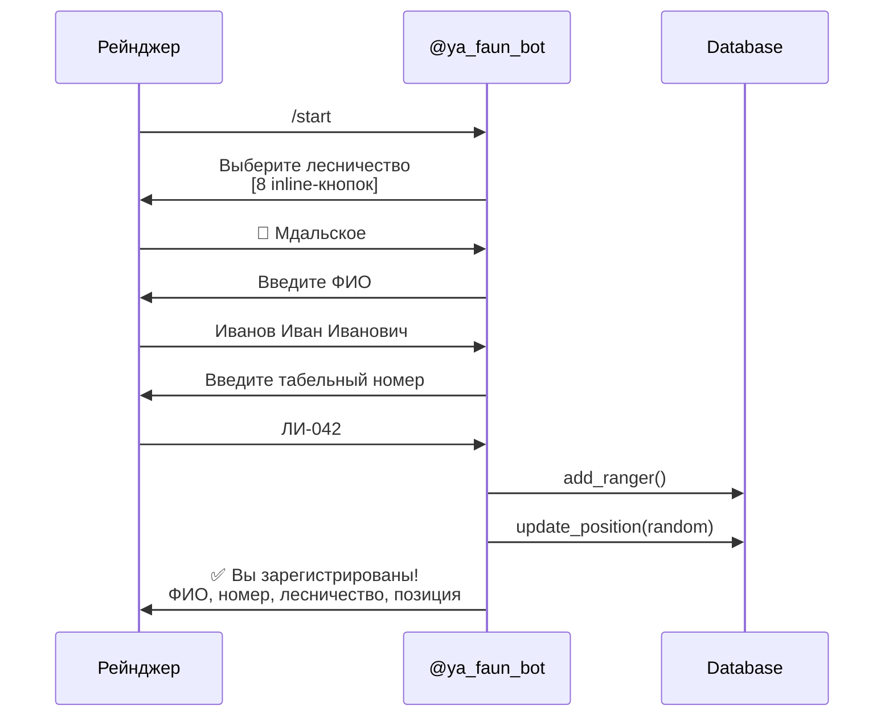

# Telegram-бот

Бот **@ya_faun_bot** — основной интерфейс взаимодействия с рейнджерами (лесными инспекторами).

## Команды

| Команда | Описание |
|---------|----------|
| `/start` | Регистрация нового рейнджера или приветствие |
| `/status` | Показать данные регистрации |
| `/stop` | Отключить оповещения (рейнджер остаётся в БД) |
| `/test` | Отправить тестовый алерт с рандомными координатами |

---

## Регистрация



### Шаги регистрации

1. **Выбор лесничества** — 9 вариантов: зонтичное Варнавинское + 8 участковых (inline-кнопки)
2. **Ввод ФИО** — минимум 2 слова (фамилия + имя)
3. **Ввод табельного номера** — непустая строка
4. **Автоматическое назначение** — зона из `DISTRICTS`, рандомная позиция внутри зоны

TTL регистрации: **30 минут** (`_REG_TTL = 1800`). После — нужно начать заново.

---

## Лесничества (Districts)

| Slug | Название | Зона покрытия |
|------|---------|---------------|
| `varnavino` | Варнавинское лесничество | 57.05–57.55°N, 44.60–45.40°E |
| `mdalskoe` | Мдальское | 57.40–57.55°N, 44.60–44.80°E |
| `semyonborskoe` | Семёнборское | 57.35–57.50°N, 44.80–45.00°E |
| `poplyvinskoye` | Поплывинское | 57.30–57.45°N, 45.00–45.20°E |
| `kamennikoskoye` | Каменниковское | 57.20–57.35°N, 44.60–44.80°E |
| `varnavinskoye` | Варнавинское | 57.15–57.30°N, 44.80–45.00°E |
| `kolesnikovskoye` | Колесниковское | 57.10–57.25°N, 45.00–45.20°E |
| `kameshnoye` | Камешное | 57.05–57.20°N, 45.10–45.30°E |
| `kayskoye` | Кайское | 57.05–57.20°N, 45.20–45.40°E |

---

## Zone-based Routing

Алерты отправляются **только** рейнджерам, чья зона (bounding box) покрывает координаты инцидента:

```python
WHERE active = 1
  AND zone_lat_min <= lat AND zone_lat_max >= lat
  AND zone_lon_min <= lon AND zone_lon_max >= lon
```

Если ни один рейнджер не покрывает точку — алерт записывается в журнал, но **не отправляется**.

---

## Rate Limiting

| Параметр | Значение | Описание |
|----------|---------|----------|
| `COOLDOWN_SECONDS` | 300 (5 мин) | Минимальный интервал между алертами одному рейнджеру |

Env var: `ALERT_COOLDOWN_SECONDS`.

---

## Incident Lifecycle

```mermaid
stateDiagram-v2
    [*] --> pending : 🔔 Алерт отправлен

    state "pending" as p {
        note right: Inline buttons:<br>На карте, Принять вызов
    }

    p --> accepted : 👤 Принять вызов
    p --> false_alarm : Другой рейнджер принял

    state "accepted" as a {
        note right: Отправлены координаты<br>Ожидание геолокации
    }

    a --> on_site : 📍 Геолокация (≤1000м)
    a --> false_alarm : Отклонено

    state "on_site" as o {
        note right: Кнопки:<br>Нарушение подтверждено<br>Ложный вызов
    }

    o --> resolved : 📋 Протокол PDF
    o --> false_alarm : Ложный вызов

    resolved --> [*]
    false_alarm --> [*]
```

### 1. Pending → Accepted

Рейнджер нажимает **"Принять вызов"** (`accept:{incident_id}`).

- Проверка: status == `pending` (защита от concurrent accept)
- Обновление: `status=accepted`, `accepted_by_*`, `accepted_at`
- Другие рейнджеры: кнопки удаляются, текст заменяется на "Вызов принял: {name}"
- Рейнджеру: координаты + ссылка на Яндекс.Карты
- Если есть drone photo — отправляется после accept

### 2. Accepted → On_site

Рейнджер отправляет **геолокацию**.

- Проверка расстояния: `haversine(ranger, incident) ≤ 1000м` (или `is_demo=True`)
- Обновление: `status=on_site`, `arrived_at`, `response_time_min`
- Рейнджеру: кнопки "Нарушение подтверждено" / "Ложный вызов"

### 3. On_site → Resolved

**Нарушение подтверждено** → сбор доказательств:

1. **Фото** — рейнджер отправляет фото нарушения
2. **Описание** — текст или голосовое сообщение (STT через SpeechKit)
3. **Юридизация** — YandexGPT переписывает описание юридическим языком
4. **RAG** — правовые статьи через File Search
5. **PDF** — генерация протокола (fpdf2)
6. **Закрытие** — `status=resolved`, PDF отправлен

### 4. False Alarm

На любом этапе рейнджер может отметить инцидент как **ложный вызов**: `status=false_alarm`.

---

## Callback-и

| Pattern | Handler | Описание |
|---------|---------|----------|
| `district:{slug}` | `district_chosen` | Выбор лесничества при регистрации |
| `accept:{incident_id}` | `accept_callback` | Принять вызов |
| `verdict:confirmed:{id}` | `verdict_callback` | Нарушение подтверждено |
| `verdict:false:{id}` | `verdict_callback` | Ложный вызов |
| `rag:action:{class}:{lat}:{lon}` | `rag_callback` | RAG: рекомендации |
| `rag:protocol:{class}:{lat}:{lon}` | `rag_callback` | RAG: шаблон протокола |

---

## Message Handlers

| Тип | Handler | Контекст |
|-----|---------|----------|
| `PHOTO` | `handle_inspector_photo` | on_site → сохранить как доказательство; иначе → Vision classification |
| `VOICE` | `voice_handler` | on_site → STT → ranger_report_raw |
| `LOCATION` | `location_handler` | accepted → проверка proximity (1000м) |
| `TEXT` | `text_handler` | Регистрация (ФИО/номер) или on_site → ranger_report_raw |

---

## Vision через фото

Если рейнджер отправляет фото **без активного инцидента**, срабатывает standalone Vision pipeline:

1. Gemma 3 27B анализирует фото
2. При обнаружении угрозы (`has_felling`, `has_human`, `has_fire`):
   - Создаётся инцидент
   - YandexGPT compose_alert
   - Алерт всем рейнджерам зоны
3. Без угрозы: текстовый ответ с описанием

---

## Формат алерта

```
*АЛЕРТ: Бензопила*
━━━━━━━━━━━━━━━━
Координаты: 57.3700 N, 44.6300 E
Уверенность: 85%
Уровень: ТРЕВОГА

Ближайший инспектор: Иванов И.И. (2.3 км)

Дрон вылетел для подтверждения

[На карте]  [Принять вызов]
```
