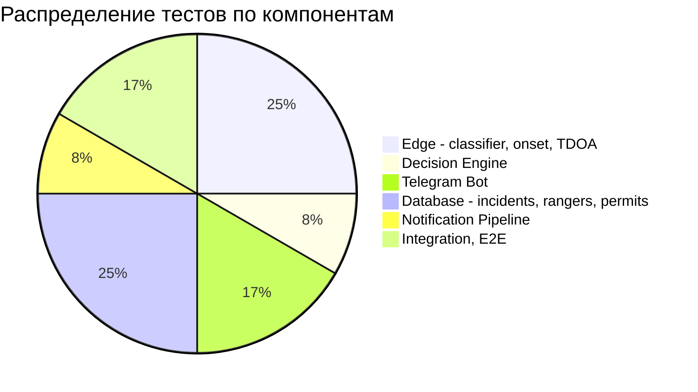

# Тестирование

## Обзор

Проект содержит **12 тестовых файлов** и `conftest.py` с общими фикстурами, покрывающих все ключевые компоненты системы.

## Запуск тестов

```bash
# Все тесты
pytest tests/ -x -q

# С подробным выводом
pytest tests/ -v --tb=short

# Один модуль
pytest tests/test_classifier.py -v

# Один тест
pytest tests/test_decider.py::test_high_confidence_alert -v
```

---

## Структура тестов

| Файл | Компонент | Описание |
|------|-----------|---------|
| `conftest.py` | Fixtures | Общие фикстуры: YAMNet моки, фабрики результатов, геометрия микрофонов |
| `test_classifier.py` | Edge / Audio | Классификация YAMNet: загрузка модели, предсказание 6 классов |
| `test_onset.py` | Edge / Audio | Onset detection: energy-ratio, пороги, edge cases |
| `test_triangulate.py` | Edge / TDOA | TDOA триангуляция: GCC-PHAT, subpixel, дистанция |
| `test_decider.py` | Edge / Decision | Confidence gating: пороги, пермиты, подавление |
| `test_bot_handlers.py` | Cloud / Telegram | Регистрация: /start, имя, номер, зона |
| `test_bot_workflow.py` | Cloud / Telegram | Workflow: принятие инцидента, статусы, кнопки |
| `test_incident_persistence.py` | Cloud / DB | Персистентность: CRUD инцидентов, state machine |
| `test_notification_pipeline.py` | Cloud / Notify | Алерты: compose, rate limiting, отправка |
| `test_permits.py` | Cloud / DB | Разрешения на рубку: проверка, валидация |
| `test_rangers.py` | Cloud / DB | Рейнджеры: регистрация, зоны, CRUD |
| `test_pipeline_integration.py` | Integration | Полный pipeline: edge → cloud → telegram |
| `test_demo_live_pipeline.py` | E2E | Live demo pipeline: полный цикл с аудио |

---

## Fixtures (conftest.py)

### Базовые

| Фикстура | Возвращает | Описание |
|-----------|-----------|---------|
| `sample_rate()` | `16000` | Частота дискретизации |
| `mock_yamnet_model()` | `(scores, embeddings, spectrogram)` | Мок YAMNet: embeddings[5, 1024] |
| `mock_head_model()` | `keras.Model` | Мок 6-классовой головы, вход 2181-dim (2048 features + padding) |

### Фабрики

| Фикстура | Создаёт | Параметры |
|-----------|---------|-----------|
| `audio_result_factory()` | `AudioResult` | Класс (chainsaw/gunshot/engine/axe/fire/background), confidence |
| `triangulation_result_factory()` | `TriangulationResult` | lat, lon, error_m |

### Геометрия

| Фикстура | Описание |
|-----------|---------|
| `triangle_mics()` | 3 микрофона — равносторонний треугольник ~100м (Москва, координаты 55.75°N 37.61°E) |

---

## Покрытие по компонентам



| Компонент | Тестовые файлы | Покрытие |
|-----------|---------------|---------|
| YAMNet classifier | `test_classifier.py` | Загрузка, предсказание, 6 классов, edge cases |
| Onset detection | `test_onset.py` | Energy-ratio, пороги, пустой вход |
| TDOA triangulation | `test_triangulate.py` | GCC-PHAT, subpixel, дистанция, ошибки |
| Confidence gating | `test_decider.py` | 3 уровня, пермиты, подавление |
| Telegram handlers | `test_bot_handlers.py`, `test_bot_workflow.py` | Регистрация, зоны, статусы |
| DB persistence | `test_incident_persistence.py` | CRUD, state machine, transitions |
| Rangers | `test_rangers.py` | Регистрация, зоны |
| Permits | `test_permits.py` | Проверка разрешений |
| Notifications | `test_notification_pipeline.py` | Compose, cooldown, отправка |
| Pipeline | `test_pipeline_integration.py`, `test_demo_live_pipeline.py` | E2E flow |

---

## CI/CD

### GitHub Actions

```yaml
# workflows/ci.yml
name: CI
on:
  push:
    branches: [main]
  pull_request:
    branches: [main]

jobs:
  test:
    runs-on: ubuntu-latest
    steps:
      - uses: actions/checkout@v4
      - uses: actions/setup-python@v5
        with:
          python-version: "3.11"
      - run: pip install -r requirements.txt
      - run: pytest tests/ -v --tb=short
```

### Локальный запуск

```bash
# Установить зависимости
pip install -r requirements.txt

# Запустить тесты
pytest tests/ -x -q

# С coverage (если установлен pytest-cov)
pytest tests/ --cov=cloud --cov=edge --cov-report=html
```

---

## Написание новых тестов

Используйте существующие фикстуры из `conftest.py`:

```python
def test_example(audio_result_factory, triangulation_result_factory):
    """Пример теста с фабриками."""
    result = audio_result_factory(label="chainsaw", confidence=0.95)
    location = triangulation_result_factory(lat=55.75, lon=37.61, error_m=15.0)

    assert result.label == "chainsaw"
    assert location.error_m < 50.0
```

Для тестов Telegram-бота используйте моки `python-telegram-bot`:

```python
from unittest.mock import AsyncMock, MagicMock

async def test_bot_command():
    update = MagicMock()
    context = MagicMock()
    update.message.text = "/start"
    # ... test handler
```
