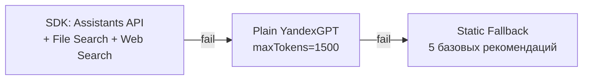
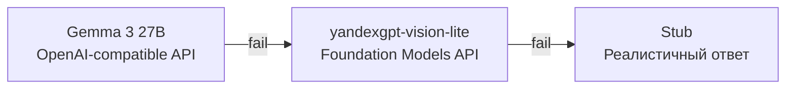

# Yandex Cloud AI Studio

Faun использует **10 сервисов** Yandex Cloud AI Studio для полного цикла обработки инцидентов.

## Обзор интеграций

| # | Сервис | Файл | Назначение |
|---|--------|------|-----------|
| 1 | YandexGPT | `cloud/agent/decision.py` | Генерация алертов для рейнджеров |
| 2 | AI Studio Assistants API | `cloud/agent/rag_agent.py` | RAG-агент с инструментами |
| 3 | File Search | `cloud/agent/rag_agent.py` | Поиск по 9 нормативным документам |
| 4 | Web Search | `cloud/agent/rag_agent.py` | Актуальные правовые нормы |
| 5 | SpeechKit STT | `cloud/agent/stt.py` | Распознавание голосовых сообщений |
| 6 | Gemma 3 27B | `cloud/vision/classifier.py` | Мультимодальный анализ фото |
| 7 | Yandex Workflows | `cloud/workflows/pipeline.py` | 12-шаговый pipeline |
| 8 | Classification Agent | `cloud/agent/classification_agent.py` | AI-верификация классификации |
| 9 | DataSphere | `cloud/agent/datasphere_client.py` | Cloud inference YAMNet |
| 10 | DataLens | `cloud/analytics/datalens.py` | Аналитический дашборд |

---

## 1. YandexGPT — Alert Composition

**Файл:** `cloud/agent/decision.py`

Генерирует короткие (2–3 предложения) алерты для рейнджеров на основе данных с датчиков и дрона.

### API

```
POST https://llm.api.cloud.yandex.net/foundationModels/v1/completion
Model: gpt://{FOLDER_ID}/yandexgpt
```

### Параметры

| Параметр | Значение |
|----------|---------|
| `temperature` | 0.2 |
| `maxTokens` | 200 |
| `stream` | false |

### System Prompt

> Ты — система мониторинга леса ForestGuard.
> Получаешь данные от акустических датчиков и дрона.
> Твоя задача: написать чёткий алерт егерю.
> - Пиши по-русски, коротко и конкретно
> - Укажи координаты, тип угрозы, рекомендацию
> - 2-3 предложения максимум

### Priority Map

| Класс звука | Приоритет |
|-------------|----------|
| chainsaw, gunshot, fire | ВЫСОКИЙ |
| остальные | СРЕДНИЙ |

### Fallback

При ошибке API возвращает статический текст: "Обнаружено нарушение. Требуется проверка инспектором на месте."

---

## 2–4. RAG Agent (Assistants API + File Search + Web Search)

**Файл:** `cloud/agent/rag_agent.py`

Юридический эксперт по лесному законодательству РФ. Использует SDK для Assistants API с инструментами File Search и Web Search.

### Fallback Chain



### File Search

- **SEARCH_INDEX_ID:** `fvttk7bjvnm39qogtoep`
- **9 документов:** Лесной кодекс, КоАП, УК РФ, приказы, региональные нормы
- Суммарный объём: ~162 KB

### Web Search

- **Домены:** `consultant.ru`, `garant.ru`, `rg.ru`
- **Контекст:** medium
- Резервный — инициализируется отдельно, ошибка не блокирует работу

### Функции RAG

| Функция | Описание |
|---------|----------|
| `query_action(class, lat, lon)` | Пошаговая инструкция для рейнджера |
| `query_protocol(class, lat, lon)` | Шаблон протокола с статьями |
| `legalize_report(class, raw_text)` | Юридизация описания рейнджера |
| `query_legal_articles(class, lat, lon)` | Только статьи (для PDF) |
| `query_rag(question, context)` | Общий RAG-запрос (REST API) |

### Маппинг нарушений

| Класс | Контекст | Статьи |
|-------|---------|--------|
| `chainsaw` | Незаконная рубка (бензопила) | ст. 260 УК, ст. 8.28 КоАП |
| `gunshot` | Браконьерство (выстрел) | ст. 258 УК, ст. 8.35 КоАП |
| `engine` | Несанкционированный въезд | ст. 8.25 КоАП |
| `axe` | Незаконная рубка (топор) | ст. 260 УК, ст. 8.28 КоАП |
| `fire` | Лесной пожар | ст. 261 УК, ст. 8.32 КоАП |

### System Prompt RAG

Детальный промпт (~2000 символов) включает:

- Описание системы Faun и pipeline
- Регион (Варнавинское лесничество)
- Список 9 документов в индексе
- Маппинг нарушений → статьи
- Правила ответа (русский, структурно, конкретные статьи с частями)

---

## 5. SpeechKit STT

**Файл:** `cloud/agent/stt.py`

Распознавание голосовых сообщений рейнджеров (OGG Opus → текст).

### API

```
POST https://stt.api.cloud.yandex.net/speech/v1/stt:recognize
```

### Параметры

| Параметр | Значение |
|----------|---------|
| `lang` | `ru-RU` |
| `format` | `oggopus` |
| `timeout` | 30s |

Используется синхронное распознавание для коротких аудио (< 30 сек).

---

## 6. Gemma 3 27B — Vision

**Файл:** `cloud/vision/classifier.py`

Анализ фотографий с дрона для обнаружения вырубки, людей, огня.

### Fallback Chain



### Gemma 3 27B

```
POST https://llm.api.cloud.yandex.net/foundationModels/v1/openai/chat/completions
Model: gemma-3-27b-it
```

- OpenAI-compatible API
- Input: base64 JPEG + текстовый промпт
- Output: JSON `{description, has_human, has_fire, has_felling}`
- `temperature: 0.1`, `max_tokens: 256`

### yandexgpt-vision-lite (fallback)

```
POST https://llm.api.cloud.yandex.net/foundationModels/v1/completion
Model: gpt://{FOLDER_ID}/yandexgpt-vision-lite
```

### VisionResult

```python
@dataclass
class VisionResult:
    description: str   # "На снимке — участок хвойного леса..."
    has_human: bool     # Обнаружены люди
    has_fire: bool      # Обнаружен огонь
    has_felling: bool   # Обнаружены следы вырубки
```

---

## 7. Yandex Workflows

**Файл:** `cloud/workflows/pipeline.py`

12-шаговый pipeline обработки инцидентов (см. [ML Pipeline](ml-pipeline.md#12-step-pipeline)).

### API (stub)

```python
register_workflow() -> {"workflow_id": "...", "status": "registered"}
run_workflow(workflow_id, input) -> {"execution_id": "...", "status": "running"}
get_workflow_status(execution_id) -> {"status": "completed|running|failed"}
```

---

## 8. Classification Agent

**Файл:** `cloud/agent/classification_agent.py`

AI-верификация edge-классификации с контекстным анализом.

### Логика

1. Проверка permits (действующие разрешения)
2. Формирование контекста (класс, уверенность, координаты, зона, NDSI)
3. YandexGPT: экспертная оценка (2–3 предложения)
4. Priority assignment с учётом permit status
5. Генерация recommended action

### Priority

| Класс | Без permit | С permit |
|-------|-----------|---------|
| chainsaw, gunshot, fire | critical | low (chainsaw/axe/engine) |
| axe | high | low |
| engine | medium | low |
| background | low | low |

### ClassificationVerification

```python
@dataclass
class ClassificationVerification:
    verified_class: str
    original_class: str
    confidence: float
    priority: str          # critical, high, medium, low
    context_analysis: str  # YandexGPT analysis
    recommended_action: str
    permit_status: str     # none, valid, expired
```

---

## 9. DataSphere

**Файл:** `cloud/agent/datasphere_client.py`

Two-tier classification: edge (быстро) + cloud (точнее).

### API

```
POST https://node-api.datasphere.yandexcloud.net/datasphere/user-node/{NODE_ID}
```

### Вход/выход

```python
# Input
{"embeddings": [0.12, 0.34, ...]}  # YAMNet embeddings (2048-dim)

# Output
{"label": "chainsaw", "confidence": 0.92}
```

### 6 классов

`chainsaw`, `gunshot`, `engine`, `axe`, `fire`, `background`

---

## 10. DataLens

**Файл:** `cloud/analytics/datalens.py`

Аналитический дашборд для управления лесным хозяйством.

### Endpoints

| Путь | Формат | Описание |
|------|--------|----------|
| `/api/v1/datalens/incidents` | JSON | Все инциденты |
| `/api/v1/datalens/stats` | JSON | Агрегированная статистика |
| `/api/v1/incidents/export` | CSV | Экспорт для DataLens |

### Метрики

- Инциденты по классам, статусам, районам
- Среднее время реагирования
- Detection rate (% resolved)
- False alarm rate
- Среднедневное количество

### Seed Data

При пустой БД (первый запуск) генерируются 200 sample incidents для демонстрации дашборда.

---

## Аутентификация

Все сервисы используют единый `YANDEX_API_KEY`:

```
Authorization: Api-Key {YANDEX_API_KEY}
```

Для YDB Serverless — сервисный аккаунт через `sa-key.json`.

### Env Vars

| Переменная | Описание |
|------------|---------|
| `YANDEX_API_KEY` | API-ключ Yandex Cloud |
| `YANDEX_FOLDER_ID` | ID каталога (`b1g5lqh1mqg84cabtejb`) |
| `SEARCH_INDEX_ID` | ID индекса File Search (`fvttk7bjvnm39qogtoep`) |
| `DATASPHERE_NODE_ID` | ID ноды DataSphere |
